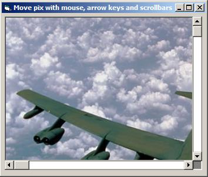



## Scroll Mouse Keys Move Pix

### Description

Move the picture with scrollbars, mouse and keys.

Just take a look at it.

It's easy, just a few lines of code.

Try it now!!
 
### More Info
 
Move the picture using mouse, arrow keys or scrollbars. Experiment with the program.

             |
---                |---
**Submitted On**   |2002-11-30 21:35:28
**By**             |[Min Thant Sin](https://github.com/Planet-Source-Code/PSCIndex/blob/master/ByAuthor/min-thant-sin.md)
**Level**          |Beginner
**User Rating**    |4.8 (19 globes from 4 users)
**Compatibility**  |VB 6\.0
**Category**       |[Miscellaneous](https://github.com/Planet-Source-Code/PSCIndex/blob/master/ByCategory/miscellaneous__1-1.md)
**World**          |[Visual Basic](https://github.com/Planet-Source-Code/PSCIndex/blob/master/ByWorld/visual-basic.md)
**Archive File**   |[Scroll\_Mou15056111302002\.zip](https://github.com/Planet-Source-Code/min-thant-sin-scroll-mouse-keys-move-pix__1-41164/archive/master.zip)

